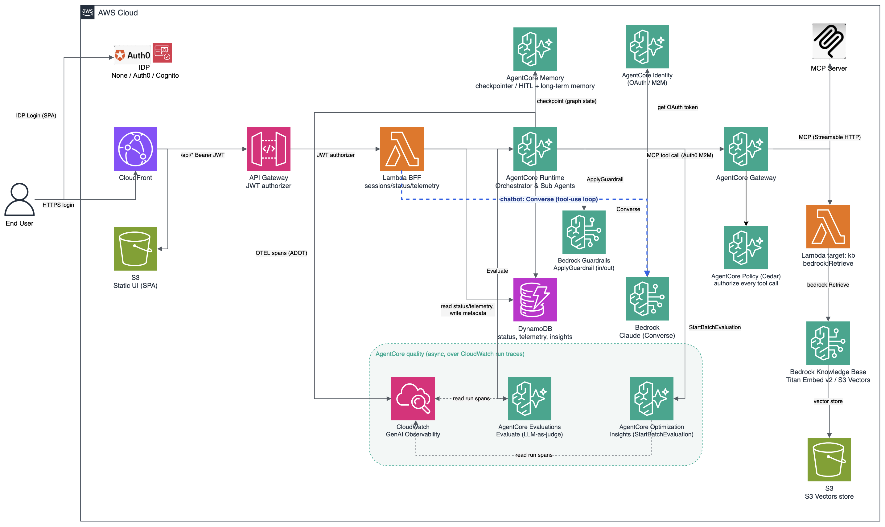

# Multi-Agent Orchestrator (LangGraph + Amazon Bedrock AgentCore)

A configuration-driven multi-agent orchestrator built with **LangGraph** and deployed
on **Amazon Bedrock AgentCore Runtime**. It runs a generic
**intake → research → analysis → report** pipeline that demonstrates the patterns you
need for your own system — sequential and parallel execution, five tool patterns,
human-in-the-loop review, content-based branching, durable state, agents you don't own —
and wires up the full AgentCore feature surface (Runtime, Gateway, Memory, Identity,
Observability, Guardrails, Evaluations, Policy, Optimization), all declared in one
`workflow.json`.

This is a **reference pattern**, not a finished product for a domain. The sample topic
and the nine agents are deliberately generic — replace the prompts, contracts and
Knowledge Base corpus with your own.

## What you edit

Start with **[`GETTING_STARTED.md`](GETTING_STARTED.md)**. Your surface is:

| You edit | For |
|---|---|
| `orchestrator/app/workflow.json` | agents, topology, tools, HITL gates, RBAC, guardrail policy, UI strings |
| `orchestrator/app/subagents/<id>/` | one folder per agent — its prompt, its contract, its `run()`. `python3 scaffold.py agent <id>` writes this and the config entry together |
| `orchestrator/app/tools/<name>/` | only for a tool that declares `source` — the handler or schema the framework packages and deploys for you |
| `orchestrator/kb_docs/` | your documents; each top-level folder becomes a corpus |
| `orchestrator/terraform/terraform.tfvars` | deploy-time only: region, login, model, Gateway on/off (copy from `.example`) |

Those two code folders mirror the two `workflow.json` blocks that can carry code of your
own: `agents` → `app/subagents/`, `tools` → `app/tools/`. Nothing else — no Terraform or
CDK edits, no Cedar policy to write, and no tests to fix. Both IaC paths generate the
Gateway targets, the authorization rules and the Guardrail from your config, and the test
suite derives its expectations from your `workflow.json` rather than naming this sample's
agents. Tests that are about this sample's own editorial choices skip when the agent they
cover is gone, and say so. A mistake in `workflow.json` fails at `terraform plan` /
`cdk synth` with a message naming the offending entry, not at deploy or at run time.

**`workflow.json` explains itself as you type.** It carries
`"$schema": "./workflow.schema.json"`, so your editor completes only the keys legal for
the `runtime` or tool `type` you chose, enumerates allowed values, flags a missing
required key, and shows on hover what a key does, which code reads it, and what it
defaults to — per variant where that differs, so `maxResults` shows 5 on a `kb` tool and
10 on a `websearch` one. `python3 format_workflow.py` enforces a canonical key order
(an agent reads identity → how it reasons → what it may read → features).

**One home per fact, enforced.** `app/keys.json` declares which keys exist and what each
defaults to; `app/vocabulary.json` holds the closed value sets; `app/workflow.schema.json`
and `app/defaults.json` are generated from them. Every plane reads those files instead of
carrying a copy, and a test fails if any Python, HCL or TypeScript fallback restates a
default the spec already declares. A drifted default is silent in a way an illegal value
is not: an illegal value is rejected at plan or synth, while a default that differs
between the two IaC paths deploys cleanly on both and behaves differently.

**Portability is checked, not claimed.** Two checks run against this repo: swapping in a
four-agent workflow from another domain (renamed agents, different topology, its own tool,
guardrail and branding), and renaming a shipped agent by touching only `workflow.json` and
its own folder. Both compile the graph and pass the full suite (815 Python +
168 IaC + 23 UI), `terraform validate` and `cdk synth` with no other change.

**Two couplings remain**, neither of which blocks a typical use case: the five tool
*types* (`kb` / `websearch` / `mcp` / `openapi` / `lambda`) are code, and Knowledge Base
storage is S3 Vectors. The `lambda` type is the escape hatch for the first — anything the
Gateway cannot reach directly (a warehouse, an RDBMS, an internal service, a VPC resource)
is reachable by pointing at a function.

Your own **vocabulary** is not a coupling: `assetType`, `sourceType` and `sectionType` are
open strings, so a `claim-file` or a `policy-doc` survives into the UI instead of being
coerced to `other`; the shared runners take your `instructions`; and which sections your
terminal asset has lives with the agent that produces it.

## Patterns demonstrated

- **Sequential + parallel** — a **parallel** group (five agents run concurrently, join at
  one gate) and a **sequence** group (two agents in order, one gate after both), side by
  side so the difference is explicit.
- **Five tool patterns, one config block.** Every data source an agent can reach is
  declared in `tools`, and both IaC paths generate the Gateway target **and** the Cedar
  permit from it. All five ship live, one per agent in the research stage:
  - **`kb`** — Bedrock Knowledge Base on **S3 Vectors**, corpus-scoped by metadata filter.
  - **`websearch`** — the AWS-managed **AgentCore Web Search** connector.
  - **`mcp`** — any remote MCP server. The default is AWS's managed **AWS Knowledge MCP
    Server**, so there is nothing to deploy and no key to supply.
  - **`openapi`** — a REST API that already has a contract, from a schema in S3. The
    Gateway publishes each `operationId` as a tool and translates the call, so there is no
    function to write. `source: "lifecycle"` uploads `app/tools/lifecycle/openapi.json`
    and derives the URI, which keeps the committed config free of a bucket name.
  - **`lambda`** — a function rather than a managed connector. Either point `lambdaArn` at
    one you already deployed, or give `source` and the framework packages and deploys
    `app/tools/<source>/`. This sample uses the second form: `source: "pricing"` builds
    `app/tools/pricing/`, which queries the public AWS Price List Query API.

  Adding a data source is a JSON edit — no HCL, no TypeScript, no policy to write.
- **Human-in-the-loop** — approve / revise / deny gates after a single agent, after a
  **parallel group** (revise re-runs only the agents you flag), and after a **sequence**
  (revise re-runs the whole chain).
- **Content-based branching** — a step's `branch` block lets the agent's own output choose
  what runs next: route a high-risk case to deeper review, skip a stage, or end the run
  early. Bypassed agents are marked **skipped** and the deciding rule is written to the
  timeline. Full syntax under [Branching](#branching).
- **Rewind & re-run** — after a run settles, re-run any single agent (plus everything
  downstream) or a subset of one parallel stage, with your note injected as that agent's
  feedback. Downstream gates re-pause; every run is kept as a numbered version with the
  comment that triggered it.
- **Structured, validated output** — every agent emits a Pydantic contract asset with an
  evidence classification and claim tracing, so a reviewer can trust, exclude or challenge
  each input.
- **Evidence is verified, not just requested.** Two controls back the prompt rules: a
  citation URL the model invented is dropped and a `sourced-fact` resting on one is
  downgraded; and a figure appearing in no upstream asset and not in the request is
  flagged on the timeline for the reviewer at the next gate. An agent with a `tool` is
  exempt from the second, because a tool is a live evidence source.
- **Agents you don't own — A2A** — a step can be an agent operated by someone else. Set
  `runtime: "a2a"` and its Agent Card URL, and the orchestrator delegates that step over
  the **Agent2Agent protocol**. No code of theirs in your repo and no new concept in the
  graph: it is an ordinary node, so gates, `branch`, re-run and version history all work.
  Guardrails and memory still apply (the framework wraps the call); evaluations and Cedar
  cannot reach inside their service, and the UI marks the boundary.
- **Per-agent runtime placement** — each agent runs **in-process** (`runtime: "main"`) or,
  by flipping one field, in its **own AgentCore Runtime** (`runtime: "dedicated"`), invoked
  via `InvokeAgentRuntime` with the trace context propagated so a run is one distributed
  trace. Three of the five research agents are dedicated here.
- **Configuration-driven identity** — one variable (`idp`) selects **Cognito**, **Auth0**
  or **no login** for both boundaries: SPA login for the UI (API Gateway JWT authorizer)
  and machine-to-machine auth for agent → Gateway calls. Provider differences are isolated
  to `terraform/identity.tf`, one branch in the Gateway client, and one login strategy in
  the SPA.
- **RBAC on human actions** — `authorization` maps JWT groups to the seven mutating
  actions (`start`, `decision`, `rerun`, `cancel`, `evaluate`, `insights`, `delete`), so
  "logged in" and "may approve" are different things. Both IaC paths create the Cognito
  groups the block names, the UI disables what you cannot use, and the in-app assistant is
  held to the same rules. An action you do not list stays open, so it is opt-in per action.
- **Run management** — cancel a running pipeline (a durable flag honored at every node
  boundary and heartbeat) and delete a previous run.
- **Durable state** — LangGraph checkpointing in **AgentCore Memory**, so a HITL pause
  survives across gates.
- **Live progress** — status mirrored to DynamoDB; the UI polls it.
- **In-app assistant** — a chat widget that answers questions about your runs (status,
  cost, latency, outputs, guardrails, evals) and takes actions (approve a gate, re-run an
  agent, run an evaluation) through the same APIs the buttons use. A Bedrock Converse
  tool-use loop in the BFF; each capability is a flag under `orchestrator.chatbot.tools`.
- **Consistent time** — every stored and displayed timestamp is US Eastern in
  `YYYY-MM-DD HH:MM:SS`, via one dependency-free helper (`app/common/clock.py`).

## The AgentCore feature surface

Every capability is declared per agent in `workflow.json` under an `agentcore` block and
applied by the framework, so turning one on is a config change and never a code change.
Each lives in its own folder under
[`orchestrator/app/features/`](orchestrator/app/features/), so you can read, keep or
delete them one at a time.

| Feature | What it does here | Config key | Code |
|---|---|---|---|
| **Runtime** | Hosts the orchestrator and each `dedicated` agent; async tasks keep the session alive across HITL pauses (8h limit) | `runtime` | `app/orchestrator/runtime.py`, `app/subagent_runtime.py` |
| **Gateway** | One OAuth-authed MCP endpoint fronting every tool | the agent's `tool` + the generated Cedar permit | `app/features/gateway/` |
| **Memory** | Short-term = the LangGraph checkpointer (deployment-wide). Long-term = semantic + summary strategies; the framework recalls an agent's past insights before it runs and stores its output after, namespaced per agent and per subject | `memory.longTerm` | `app/features/memory/` |
| **Identity** | Outbound Workload Identity tokens for calling an external API directly | `identity.outbound` | `app/features/identity/` |
| **Observability** | OTEL session grouping, one AGENT span per agent with real token counts, per-tool spans, cross-runtime trace propagation, and metering of every model/tool/memory/guardrail/policy/eval event | always on | `app/features/observability/` |
| **Guardrails** | Bedrock `ApplyGuardrail` on agent input and/or output; a block halts the run with the guardrail's message | `guardrails.input`, `guardrails.output`, `guardrails.guardrailId` | `app/features/guardrails/` |
| **Evaluations** | LLM-as-judge over the agent's real run, scored per named prompt per version. `auto` scores at completion; the UI's Evaluate button re-runs on demand | `evaluations.{enabled,auto,evaluators}` | `app/features/evaluations/` |
| **Policy** | Cedar authorization enforced server-side at the Gateway (default-deny in `ENFORCE`, or `LOG_ONLY`) | `orchestrator.policy`, `policy.enabled` | `app/features/policy/`, `terraform/policy.tf` |
| **Optimization** | Cross-run Insights: a batch evaluation over recent traces surfacing failure patterns, user intents and execution summaries | `orchestrator.insights` | `app/features/optimization/` |

**Observability, in detail.** Every model / tool / memory / guardrail / policy / eval /
compute event is metered (exact Bedrock tokens via `CountTokens`, latency, estimated USD)
to a telemetry table. The Observability tab gives you:

- **Overview** — aggregate by date / model / user over a range, with cost projection and
  CSV/JSON export.
- **Run detail** — per-agent cost, latency and tokens, expandable to individual calls,
  plus a **Prompts & I/O inspector** showing the exact system prompt, input and output of
  every model call, every tool query and its retrieved context, every memory recall/store
  with its namespace, and every guardrail and policy decision — grouped by run version,
  with the reviewer feedback that triggered each version and the evaluation scores.
- **Insights** — the cross-run batch analysis.

It stays inside `app/features/observability/` + `terraform/observability.tf` +
`web/legacy/observability.js`, so it can be understood or removed as a unit. The UI half
is mounted as an **island** — `web/src/views/Observability.tsx` hands the module a
container and the auth token, and nothing else is shared — so it kept working unchanged
when the rest of the UI was rebuilt on Cloudscape.

## The workflow

A four-stage, nine-agent pipeline, defined entirely in
[`orchestrator/app/workflow.json`](orchestrator/app/workflow.json). It deliberately
contrasts a parallel group with a sequence group:

```
1 intake ─(HITL)─▶ 2 [ knowledge_research ‖ web_search ‖ documentation_search
     │                 ‖ cost_research ‖ lifecycle_research ]
     │                 ─(HITL)─▶ 3 [ analysis → recommendation ] ─(HITL)─▶ 4 report
     ├──(branch)──▶ 3, skipping research, if the brief has no research questions
     └──(branch)──▶ END, if the brief has no objective at all
```

Agents are keyed by semantic id; each agent whose code you ship has a self-contained
package under `app/subagents/<id>/`. Two of the nine have none, because they are not yours
to ship — see stage 3.

| # | Stage | Agent id(s) | Pattern | Notes |
|---|-------|-------------|---------|-------|
| 1 | Request Intake | `intake` | single | turns the request into a structured brief; HITL gate, then a `branch` on that brief |
| 2 | Research | `knowledge_research`, `web_search`, `documentation_search`, `cost_research`, `lifecycle_research` | **parallel** — RAG ‖ Web Search ‖ MCP ‖ Lambda ‖ OpenAPI; the first three on dedicated runtimes | one per tool pattern, so one deployment exercises all five; one HITL group gate after all five |
| 3 | Analysis → Recommendation | `analysis`, `recommendation` | **sequence**, both `runtime: "a2a"` | agents this deployment does not operate, reached over the Agent2Agent protocol. One gate after both (revise re-runs the chain). No folder under `app/subagents/` for either. Both still produce real contract assets — the framework stamps the asset envelope on a structured reply, so `report` traces its sections to their `assetId`s exactly as for a local agent |
| 4 | Report | `report` | terminal | assembles the sectioned report (no gate) |

Each agent binds a data source with one field — `tool`, plus `corpus` for a Knowledge Base
tool — and carries declarative `access` / `produces` metadata surfaced as chips in the UI,
plus its `agentcore` block. The nine use deliberately different combinations so one
deployment exercises the whole surface:

| Agent | Runtime | Tool | Reasons with | Long-term memory | Guardrails | Evaluations | Policy |
|---|---|---|---|---|---|---|---|
| `intake` | main | — | `ctx.llm` | — | input | auto | — |
| `knowledge_research` | dedicated | `kb` (corpus `reference`) | nested LangGraph | — | — | on demand | enabled |
| `web_search` | dedicated | `websearch` | Strands | — | output | on demand | enabled |
| `documentation_search` | dedicated | `docs` (MCP) | `ctx.llm` | — | output | on demand | enabled |
| `cost_research` | main | `pricing` (Lambda, from `app/tools/pricing/`) | `ctx.llm` + code | — | — | on demand | enabled |
| `lifecycle_research` | main | `lifecycle` (OpenAPI, schema from `app/tools/lifecycle/`) | `ctx.llm` + code | — | — | on demand | enabled |
| `analysis` | **a2a** | its own | someone else's | semantic | output | on demand, role descriptor | outside ours |
| `recommendation` | **a2a** | its own | someone else's | semantic + summary | output | on demand, role descriptor | outside ours |
| `report` | main | — | `ctx.llm` | — | input + output | auto | — |

The `a2a` rows show what a trust boundary costs and what it does not. **Long-term memory
works in both directions** — the recall is sent to the remote agent inside the A2A task,
carrying the caveat that it is recollection and not evidence. **Guardrails still apply**,
because the framework wraps the call. **Evaluations degrade**: with no local model call
there is no captured prompt, so an evaluation scores a role descriptor plus the real
output — which is why those two are `auto: false` with a narrower evaluator list
(Faithfulness is dropped; there is no source context to be faithful to). **Cedar cannot
reach their tool calls at all.**

## Branching

`steps` is a fixed pipeline and `hitl` lets a human redirect it. A `branch` on a step is
the third case: the step's own output picks what runs next. No agent code — the deciding
agent returns its normal output.

The branch this sample ships, on the intake step:

```json
{ "agent": "intake", "hitl": true,
  "branch": {
    "when": [
      { "field": "objective",    "exists": false, "goto": "END" },
      { "field": "keyQuestions", "lt": 1,         "goto": "analysis_reco" }
    ]
  } }
```

If the brief has no objective there is nothing downstream can work with, so end the run;
if it has no research questions there is nothing to gather, so jump to analysis over the
brief. Neither fires on a normal request — you see one timeline line saying no rule
matched.

### `field` is a key in the agent's output

The branch node takes the deciding agent's output, parses it as JSON, follows `field` as a
dot path, and compares:

```
intake returned:  { "objective": "Design a serverless pipeline", "keyQuestions": ["q1", "q2"] }
rule:             { "field": "keyQuestions", "lt": 1, "goto": "analysis_reco" }
                    dot-path lookup → ["q1","q2"] → length 2 → 2 < 1 is false → next rule
```

So the field must be one your agent emits — that is your business, in
`app/subagents/<id>/prompts.py`. The framework holds no opinion about which fields exist
or what their values mean.

- `findings.0.claim` works — a numeric segment indexes a list.
- **Omit `field`** and the comparison runs against the raw output text, so
  `{ "contains": "URGENT", "goto": "escalate" }` works on an agent that returns prose.
- An absent field matches **only** `exists: false`. Every other operator needs a value, so
  it evaluates to no-match rather than to zero or empty.

### Operators

One or more per rule; several in one rule are ANDed.

| Operator | Takes | True when |
|---|---|---|
| `equals` | a value | the value matches |
| `notEquals` | a value | it does not |
| `in` | a **list** | the value is one of them |
| `contains` | a value | substring of a string, or membership of a list or of a dict's keys |
| `exists` | `true` / `false` | `true`: present and not null, `""`, `[]` or `{}`. `false`: the negation |
| `gt` `gte` `lt` `lte` | a number | numeric comparison. A **list or dict compares by length**, so `{ "field": "openQuestions", "gt": 0 }` reads as "there is at least one" |

`equals`, `notEquals`, `in` and `contains` compare on stripped, case-folded text, and a
numeric string compares as a number. The value was written by a model: one told to return
`escalate` will sometimes return `Escalate` or ` ESCALATE`, and one asked for a score
returns `"85"` about as often as `85`.

### Targets and placement

- Rules are tried in order and the **first match wins** — put the specific case first.
- No match falls to `default`. **With no `default` the run continues to the next step**, so
  adding a `branch` can redirect a run but never strand one.
- A `default` with no `when` is an unconditional jump. That is what makes two paths
  exclusive rather than merely optional.
- A target names a **step**, not an agent inside one: a single-agent step's `agent` id, a
  group step's `gateId`, or `"END"`. Jumping to a `parallel` stage enters the whole stage
  instead of stranding its gate on siblings that never ran. Targets must be **later**
  steps; going backwards is what a gate's `revise` is for.
- Put it on a single-agent step or a `sequence` step (its **last** agent decides). Not on a
  `parallel` step — no single agent's output decides — and not on the last step.
- With a `hitl` gate on the same step the human approves first, then the branch reads the
  output they approved.

Both IaC paths validate all of this before anything deploys, because each mistake is
otherwise silent: a misspelled operator, a rule with no comparison and a target that names
nothing all evaluate to "no match", so the run quietly takes the default every time and
the branch looks like it is working.

A fuller example and the full key reference are in
[`docs/WORKFLOW_REFERENCE.md`](orchestrator/docs/WORKFLOW_REFERENCE.md#branch--the-output-decides-what-runs-next).

### What you see when it fires

The stage gets a `⑂ Branch` pill in the diagram (hover for the rules), the timeline records
the rule that matched and where it went, and bypassed agents are marked **skipped** rather
than left looking queued:

```
Branch after intake: keyQuestions lt 1 -> analysis_reco
                     · skipping knowledge_research, web_search, documentation_search,
                       cost_research, lifecycle_research
```

## Architecture



> [`architecture.drawio`](architecture.drawio) is the editable source — open it at
> [diagrams.net](https://app.diagrams.net) or the VS Code Draw.io extension and re-export
> to `architecture.png` after any change.

```
                    ┌── IdP ─────┐  (SPA login for users; M2M tokens for the runtime)
                    │  Cognito / │  selected by `idp`; Auth0 and "no login"
                    │  Auth0     │  are drop-in alternatives
                    ▼            ▼
Browser ─▶ CloudFront ─┬─▶ S3 (static UI)
   (Bearer JWT)        └─▶ API Gateway (JWT authorizer) ─▶ Lambda (BFF)
                             │                               (reads DynamoDB status)
                             │ InvokeAgentRuntime
                             ▼
                     AgentCore Runtime (orchestrator)  ──▶ AgentCore Memory
                     LangGraph: 1→[2‖2‖2‖2‖2]→[3→3]→4        ├─ checkpointer (HITL pause/resume)
                       │                                     └─ long-term semantic + summary
                       │  └─ InvokeAgentRuntime ─▶ Dedicated runtimes (3 research agents)
                       │       (+ trace context)
                       │  └─ SigV4 ─▶ Lambda Function URL (the a2a stand-in agents)
                       │ M2M client-credentials token          │
                       ▼                                       ▼
                     AgentCore Gateway (CUSTOM_JWT / the IdP)  DynamoDB (status + events
                       │  └─ Cedar Policy Engine (ENFORCE)      + telemetry + insights)
                       │     (permits generated from the `tools` block)
                       ├─ target: KB retrieve Lambda ▶ Bedrock KB (S3 Vectors)  type=kb
                       ├─ target: AgentCore Web Search (managed connector)      type=websearch
                       ├─ target: a remote MCP server                           type=mcp
                       ├─ target: a REST API, from an OpenAPI schema in S3      type=openapi
                       └─ target: a Lambda (yours, or built from app/tools/)    type=lambda
                       │
                       ├─▶ Bedrock Guardrails (ApplyGuardrail, per agent in/out)
                       ├─▶ AgentCore Evaluations (LLM-as-judge over the real run)
                       └─▶ CloudWatch (OTEL spans, Transaction Search) ─▶ AgentCore Insights

   UI polls status ◀── DynamoDB ◀── runtime writes progress
```

- **Orchestrator runtime** runs the LangGraph pipeline. On invoke it registers an async
  task, runs the workflow in the background and returns immediately, so the session
  survives HITL pauses up to the 8-hour limit.
- **Gateway** is a single OAuth-authed MCP endpoint fronting the whole tool plane.
- **BFF (Lambda)** invokes the runtime and serves DynamoDB-backed status plus the workflow
  definition, so the UI renders dynamically. `/api/*` sits behind the JWT authorizer.
- **UI** is a **Vite + React + TypeScript** console built on the **AWS Cloudscape Design
  System**, served as static files from S3/CloudFront. It logs in via the configured IdP,
  renders the DAG and every table from `/api/workflow`, drives the gates, and polls for
  progress. Both IaC paths build it from source, so a deploy needs Node 22 (or a
  container engine) and a TypeScript error fails the deploy.

## Repository layout

```
orchestrator/
├── app/
│   ├── workflow.json           # SINGLE SOURCE OF TRUTH: orchestrator + ui + guardrail
│   │                           #   + authorization blocks, tools, agents (incl. their
│   │                           #   agentcore features), topology + HITL gates
│   ├── keys.json               # FRAMEWORK-OWNED: which keys workflow.json may contain,
│   │                           #   where each is legal, what reads it, what it defaults
│   │                           #   to. Its key order IS the canonical order
│   ├── vocabulary.json         # FRAMEWORK-OWNED: the closed VALUE sets, read by all
│   │                           #   three planes
│   ├── workflow.schema.json    # GENERATED from those two — what your editor validates
│   │                           #   against, carrying each key's doc, values and default
│   ├── defaults.json           # GENERATED from keys.json: every default, and the only
│   │                           #   one of the three that ships in the image (keys.json
│   │                           #   is 45 KB of prose, kept out by .dockerignore)
│   ├── entry.py                # container entrypoint: AGENT_ID set -> a dedicated agent
│   ├── subagent_runtime.py     # per-agent AgentCore Runtime app (hosts one agent)
│   ├── common/                 # shared framework used by orchestrator + agents
│   │   ├── base.py             #   Agent base class (the author contract)
│   │   ├── context.py          #   AgentContext: input(), llm(), call_tool(), retrieve(),
│   │   │                       #     heartbeat(), log() + the AgentCore feature helpers
│   │   ├── config.py           #   loads workflow.json + env/infra settings
│   │   ├── defaults.py         #   reads defaults.json; no plane restates a default
│   │   ├── state.py            #   graph state + reducers
│   │   ├── agentcore_agent.py  #   node body for a dedicated agent (InvokeAgentRuntime)
│   │   ├── a2a_agent.py        #   runtime "a2a": delegate a step over the Agent2Agent
│   │   │                       #     protocol to an agent you do NOT operate
│   │   ├── assets.py           #   asset plumbing both runners use (brief, versioning,
│   │   │                       #     JSON repair, provenance, citation verification)
│   │   ├── branching.py        #   the `branch` rule language (schema-agnostic)
│   │   ├── grounding.py        #   figures in an asset must trace to its inputs
│   │   ├── contracts/base.py   #   the asset ENVELOPE every agent's output shares
│   │   ├── clock.py            #   Eastern-Time helper (YYYY-MM-DD HH:MM:SS ET)
│   │   └── llm.py, sink.py, bus.py, errors.py, vocabulary.py
│   ├── features/               # ONE FOLDER PER AGENTCORE CAPABILITY
│   │   ├── gateway/            #   MCP tool access (M2M token per IdP + Streamable HTTP)
│   │   ├── memory/             #   long-term semantic recall + store
│   │   ├── identity/           #   Workload Identity outbound OAuth tokens
│   │   ├── observability/      #   OTEL spans + metering + pricing
│   │   ├── guardrails/         #   Bedrock ApplyGuardrail on input/output
│   │   ├── evaluations/        #   LLM-as-judge over real runs, per prompt per version
│   │   ├── policy/             #   Cedar authorization (enforced at the Gateway)
│   │   └── optimization/       #   cross-run Insights (batch evaluation)
│   ├── orchestrator/
│   │   ├── graph_builder.py    #   builds the LangGraph (single / parallel / sequence
│   │   │                       #     steps + their gates) + rewind planning
│   │   ├── nodes.py            #   generic agent node (spans, tokens, guardrails, memory,
│   │   │                       #     grounding) + the HITL gate wrappers
│   │   ├── registry.py         #   node factory: main vs dedicated vs a2a
│   │   ├── runtime.py          #   AgentCore entrypoint (start / resume / rerun_from /
│   │   │                       #     evaluate / insights)
│   │   └── server.py           #   local dev server (same API + UI)
│   ├── tools/<source>/         # YOURS TO EDIT: one folder per tool that declares
│   │   │                       #   `source`. Which file depends on the tool's type.
│   │   │                       #   Excluded from the orchestrator image — these run
│   │   │                       #   outside the container
│   │   ├── pricing/handler.py     # type="lambda": zipped, deployed, wired to the Gateway
│   │   └── lifecycle/openapi.json # type="openapi": uploaded to S3 and the URI derived.
│   │                              #   Each operationId becomes a tool; anything omitted
│   │                              #   is unreachable, so the schema is the allow-list
│   └── subagents/<id>/         # one package per agent WHOSE CODE YOU SHIP (agent.py +
│       │                       #   prompts.py + __init__.py): intake, knowledge_research,
│       │                       #   web_search, documentation_search, cost_research,
│       │                       #   lifecycle_research, report. `analysis` and
│       │                       #   `recommendation` have no folder — runtime "a2a"
│       └── _shared/            # SAMPLE code the agents share, not framework:
│                               #   research.py (gather evidence from a tool),
│                               #   synthesis.py (reason over upstream assets),
│                               #   strands_bridge.py, contracts/ (the five asset shapes)
├── web/                        # the console UI: Vite + React + TypeScript on the AWS
│   │                           #   Cloudscape Design System. BUILT at deploy time by
│   │                           #   both IaC paths (`npm ci && npm run build`), so a
│   │                           #   deploy needs Node 22 or a container engine
│   ├── src/App.tsx             #   the console shell: AppLayout, TopNavigation,
│   │                           #     SideNavigation, breadcrumbs, SplitPanel, Flashbar
│   ├── src/views/              #   Graph (a Step Functions-style canvas), RunsTable,
│   │                           #     RunDetail, StepPanel, HitlGate, StartRunModal,
│   │                           #     Assistant, AboutPanel, Observability
│   ├── src/assets/             #   the SHAPE-driven asset renderer: a customer's own
│   │                           #     asset type gets first-class layout with no code
│   │                           #     change, chosen by shape not by field name
│   ├── src/api.ts, src/auth.ts #   one exit point for requests (with 401 -> refresh ->
│   │                           #     replay), and the IdP strategies
│   ├── legacy/observability.js #   the Observability tab, mounted as an ISLAND rather
│   │                           #     than ported: charts, drilldown, I/O inspector,
│   │                           #     evaluation scores, Insights, export
│   └── auth-config.js.tftpl    #   IdP settings rendered into the page at deploy time
├── bff/handler.py              # Lambda BFF (sessions, decisions, cancel, rerun, evaluate,
│                               #   insights, telemetry reads, /api/me)
├── bff/authz.py                # RBAC: JWT groups -> which run actions a caller may take
├── bff/chatbot.py              # in-app assistant: Bedrock Converse tool-use loop
├── kb_lambda/handler.py        # Gateway Lambda target: Bedrock KB retrieve
├── a2a_lambda/handler.py       # the A2A stand-in the two remote agents run on, so the
│                               #   protocol path is exercised end to end out of the box
├── format_workflow.py          # canonical key order + formatting (--check for CI)
├── build_schema.py             # regenerate workflow.schema.json + defaults.json (--check)
├── scaffold.py                 # `scaffold.py agent <id>` — writes the config entry AND
│                               #   the app/subagents/<id>/ folder
├── docs/WORKFLOW_REFERENCE.md  # every workflow.json key, what reads it, what it does
├── kb_docs/reference/          # sample Knowledge Base corpus (replace with your own)
├── tests/                      # config-plane suite (pytest; no AWS, no model, ~15s)
├── pyproject.toml, Dockerfile, requirements.txt, requirements-dev.txt
├── cdk/                        # CDK / TypeScript IaC (full parity with terraform/)
│   ├── bin/orchestrator.ts     #   app entrypoint (context: agentName, modelId, idp, …)
│   ├── lib/orchestrator-stack.ts  # runtimes, DynamoDB, BFF/API, S3+CloudFront UI, a2a
│   ├── lib/tool-plane.ts       #   Gateway + Knowledge Base + Cedar policy
│   ├── lib/defaults.ts         #   reads app/defaults.json
│   ├── lib/vocabulary.ts       #   reads app/vocabulary.json
│   └── test/                   #   config-plane tests (jest) incl. Terraform↔CDK parity
└── terraform/
    ├── main.tf                 # orchestrator runtime, BOTH memories, ECR + image
    │                           #   build/push, IAM, OTEL env
    ├── subagent_runtimes.tf    # one AgentCore Runtime per dedicated agent
    ├── a2a.tf                  # the A2A stand-in Lambda + its IAM-authed Function URL
    ├── identity.tf             # IdP abstraction: the one place Cognito/Auth0/none differ
    ├── cognito.tf              # User Pool + domain + SPA/M2M clients (idp=cognito)
    ├── gateway.tf              # Gateway + CUSTOM_JWT authorizer + policy attachment
    ├── tools.tf                # GENERATES every Gateway target + Cedar permit from `tools`
    ├── kb.tf                   # S3 Vectors + Bedrock KB + retrieve Lambda (type=kb)
    ├── guardrail.tf            # Bedrock Guardrail
    ├── policy.tf               # Cedar policy engine; rules come from tools.tf
    ├── optimization.tf         # Insights findings table + batch-evaluation IAM
    ├── transaction_search.tf   # CloudWatch Transaction Search (idempotent)
    ├── observability.tf        # telemetry table (+ by_date GSI) + IAM + UI asset
    ├── bff.tf, ui.tf, dynamo.tf, variables.tf, outputs.tf, versions.tf
    ├── bootstrap-state.sh      # creates the S3 backend bucket
    ├── teardown.sh             # what `terraform destroy` cannot undo
    └── deploy-role-policy.json # the scoped IAM policy a deploy role needs
```

## Add or change an agent

An agent's `workflow.json` key IS its package name under `app/subagents/<id>/`; `runtime`
decides where it runs. All three placements use the same `Agent` interface, so the graph
wiring is identical.

**The short way** — writes the config entry and the folder together:

```bash
cd orchestrator
python3 scaffold.py agent triage --tool kb        # --dry-run to preview
```

What it generates is complete rather than a stub: `run()` really calls the model and
returns its answer, so you can deploy it and then make it yours. It deliberately does not
put the agent in `steps`, because where a step belongs depends on what it consumes.

**The long way:**

1. Create `orchestrator/app/subagents/<id>/agent.py` (and a `prompts.py`):
   ```python
   from app.common.base import Agent

   class MyAgent(Agent):
       system_prompt = "You are ..."
       async def run(self, ctx):
           return await ctx.llm(self.system_prompt, ctx.input("analysis") or ctx.topic)

   agent = MyAgent()
   ```
   and `__init__.py` with `from .agent import agent`.

   **That is the whole contract** — a package exporting `agent`, an `Agent` subclass, a
   `run()` — and `registry.check_agent_module` enforces exactly those three, naming the
   file and the fix when one is missing. Worth knowing: `Agent.run` raises
   `NotImplementedError`, so a folder that was started and never finished imports cleanly,
   configures cleanly, appears on the diagram and fails the instant the run reaches it.
   `tests/test_subagents.py` catches that at `pytest`. Everything else about the folder is
   yours; keeping the prompt in `prompts.py` is convention, not a requirement.
2. Add it under `agents` in `workflow.json` and place it in `steps` (a single step, a
   `parallel` group, a `sequence` group, and/or `"hitl": true`).
   - In-process (default): `"runtime": "main"`.
   - Own runtime: `"runtime": "dedicated"` — both IaC paths provision it, because both
     read `workflow.json`.
3. Give it an `agentcore` block for the capabilities it needs:
   ```json
   "agentcore": {
     "memory":      { "longTerm": ["semantic"] },
     "identity":    { "outbound": ["my-api-oauth"] },
     "guardrails":  { "input": true, "output": true },
     "evaluations": { "enabled": true, "auto": true,
                      "evaluators": ["Builtin.Faithfulness"] },
     "policy":      { "enabled": true }
   }
   ```
   Omit the block and the agent runs with no features attached.
4. Redeploy. The graph, dedicated runtimes, status tracking, features and UI pick it up.

Inside `run()` you may also call the helpers directly — `ctx.guardrail(text, "INPUT")`,
`ctx.memory_recall(q)`, `ctx.memory_store(text)`, `ctx.get_identity_token(provider)`,
`ctx.policy_check(action)`. Each is a **no-op when disabled** for that agent, so they are
always safe to call. Guardrails and long-term memory are already applied by the node
wrapper; the explicit calls are for extra checks (see
`app/subagents/knowledge_research/agent.py` for `policy_check`).

### Author an agent with any agentic framework

`run()` is a plain `async def`, so what happens inside it is yours — including driving
another agentic framework, per agent. Two of the five research agents do:

| Agent | Reasons inside | Why it is interesting |
|---|---|---|
| `web_search` | a **Strands** agent | Strands' agent loop and prompt handling, over this repo's model call |
| `knowledge_research` | a **nested LangGraph** | a graph inside one node of the outer graph, with a conditional edge that gives an unparseable draft one repair attempt |
| `documentation_search` | nothing — one `ctx.llm` call | the control, so the comparison means something |
| `cost_research` | nothing, and its own `run()` | the model decides *which* services; code does the arithmetic |

All four bind their data source in `workflow.json` and emit the same `ResearchOutput`
contract, so nothing downstream can tell which is which.

**The one rule: the model call goes through `ctx.llm`.** Guardrails, cost and token
telemetry, memory injection, truncation detection and cancellation all live there. A
framework holding its own Bedrock client loses every one of them *and still reports
success*. `app/subagents/_shared/strands_bridge.py` is ~200 lines showing how to satisfy a
framework's model-provider interface with `ctx.llm`; a CrewAI `BaseLLM` or a LangChain
`BaseChatModel` is the same shape.

For an evidence-gathering agent there is a ready-made seam — pass `think=` to
`research.synthesize` and the evidence gathering and contract assembly around it stay put:

```python
from app.subagents._shared import research
from app.subagents._shared.strands_bridge import strands_thinker

async def run(self, ctx):
    return await research.synthesize(ctx, system_prompt=SYSTEM_PROMPT,
                                     think=strands_thinker(ctx))
```

Two constraints before you reach for one:

- **No native tool calling.** `ctx.llm` returns text, so it cannot carry a `toolUse` block
  and a framework's own `@tool` would never be invoked. The bridges **raise** if a
  framework offers them tools, because a dropped tool produces a plausible answer and no
  way to notice. Data access is declared in `workflow.json` and called with
  `ctx.call_tool` / `ctx.retrieve` before the model call.
- **Budget for the dependency.** There is one container image for every agent, so every
  agent pays for every framework in it. Measured on Python 3.13 site-packages: this repo's
  `requirements.txt` is 153 MB, `+ strands-agents` 166 MB, `+ crewai` 804 MB — a 5× image
  that also caps the project at Python <3.14, which is why CrewAI is documented and not
  shipped. LangGraph costs nothing extra: it is already the outer orchestrator.

## Run locally

```bash
python -m venv .venv && source .venv/bin/activate
pip install -r orchestrator/requirements-dev.txt

cd orchestrator/web && npm ci && npm run build   # the UI is compiled, not copied
cd .. && uvicorn app.orchestrator.server:app --port 8090
# open http://127.0.0.1:8090
```

Editing the UI? Run Vite instead and get hot reload, with the API proxied back to the
local server:

```bash
cd orchestrator/web
VITE_API_BASE=http://127.0.0.1:8090 npm run dev   # then open http://127.0.0.1:5173
```

The local server returns the **same `/api/workflow` projection the deployed BFF returns**,
so the page is fed the shape it will get in production. The routes that read deployed
DynamoDB tables — telemetry, the assistant — answer with a well-formed empty response and
a note saying so, rather than a 404 the page would surface as a red error.

> **There is no offline mode, by design.** This framework never fabricates data: a failed
> model call raises `ModelUnavailable` and an unreachable tool raises `ToolUnavailable`, so
> the run fails with the reason on the agent that failed. A simulated answer is
> indistinguishable from real evidence once it reaches the report. See
> [`app/common/errors.py`](orchestrator/app/common/errors.py).

- Local dev needs working **AWS credentials** with Bedrock model access.
- Agents bound to a `tool` need a deployed Gateway. Remove the `tool` binding to run a
  reasoning-only subset locally.
- `dedicated` agents return a "not configured" placeholder locally — there are no
  dedicated runtimes to invoke off-cloud.

## Deploy

Two IaC options with full parity. They can target different accounts or regions
simultaneously (resource names include the account id, so there are no collisions).

- **Terraform** (`orchestrator/terraform/`) — see **[`DEPLOYMENT.md`](DEPLOYMENT.md)**.
- **CDK / TypeScript** (`orchestrator/cdk/`) — see
  **[`orchestrator/cdk/README.md`](orchestrator/cdk/README.md)**.

Both provision the same resources and all nine AgentCore capabilities. `enable_gateway` /
`-c enableGateway` controls the tool plane: with it off no Gateway is created and any agent
bound to a `tool` fails fast rather than inventing evidence — which in this sample is all
five research agents, so leave it on unless you are deliberately testing that path.

Both take the same `idp` switch (`cognito`, `auth0`, `none`) and both can auto-create
Cognito, so no pre-existing auth infrastructure is required.

### Terraform

Requires Terraform ≥ 1.10, a container engine (Finch/Docker/Podman), **Node.js ≥ 20** for
the UI build, and AWS credentials.

```bash
cd orchestrator/terraform
cp terraform.tfvars.example terraform.tfvars   # then edit
terraform init
terraform apply                                # builds the image AND the UI bundle,
                                               #   then provisions everything
```

| Login mode | `terraform.tfvars` |
|---|---|
| **Cognito, created for you** (recommended) | `idp = "cognito"`, `cognito = { create = true }` |
| **Cognito, bring your own** | `idp = "cognito"`, `cognito = { create = false, user_pool_id = …, client_id = …, domain_prefix = … }` |
| **Auth0** | `idp = "auth0"`, `auth0 = { domain = …, client_id = … }` |
| **No login** (sandbox only) | `idp = "none"`, `enable_gateway = false` |

Outputs include `ui_url`, `api_endpoint`, `cognito_user_pool_id`, `cognito_domain_prefix`
and `login_client_id`. With `cognito = { create = true }` Terraform wires the CloudFront
URL into the App Client's callback and sign-out URLs; only a bring-your-own pool needs that
by hand. Tear down with `terraform destroy`, then `./teardown.sh` for what destroy cannot
undo.

### CDK (TypeScript)

```bash
cd orchestrator/cdk
npm install
export CDK_DOCKER=finch          # only if you don't have Docker
cdk bootstrap                    # first time per account/region
cdk deploy -c idp=cognito -c createCognito=true -c enableGateway=true
```

| Login mode | Command |
|---|---|
| **Cognito, created for you** (recommended) | `cdk deploy -c idp=cognito -c createCognito=true` |
| **Cognito, bring your own** | `cdk deploy -c idp=cognito -c cognitoUserPoolId=… -c cognitoClientId=… -c cognitoDomainPrefix=…` |
| **Auth0** | `cdk deploy -c idp=auth0 -c auth0Domain=… -c auth0ClientId=…` |
| **No login** (sandbox only) | `cdk deploy -c idp=none` |

`enableGateway` defaults to **false** here (it is `false` in `cdk.json`), unlike
Terraform's `true`. After deploy, add the `uiUrl` output to Cognito's callback and
sign-out URLs unless CDK created the pool. Tear down with `cdk destroy`.

## Configuration

Deploy-time settings for the **Terraform** path:

| Variable / env var | Default | Purpose |
|---|---|---|
| `region` / `AWS_REGION` | `us-east-1` | Region |
| `agent_name` | `multiagent_orchestrator` | Prefixes every resource name |
| `model_id` / `BEDROCK_MODEL_ID` | `us.anthropic.claude-haiku-4-5-20251001-v1:0` | Default model (env > `orchestrator.defaultModel` > this) |
| `idp` | `cognito` | `cognito`, `auth0`, or `none` (no login) |
| `enable_gateway` | `true` | Create the Gateway + KB (OAuth-authed) |
| `cognito` | `{}` | `create`, `user_pool_id`, `client_id`, `domain_prefix` |
| `auth0` | `{}` | `domain`, `client_id` (SPA application) |
| `gateway_identity` | `{}` | M2M client for agent → Gateway: `client_id`, `audience` |
| `gateway_client_secret` | — (via `TF_VAR_…`) | M2M secret; unneeded when Terraform creates the Cognito client |
| `tool_api_keys` | `{}` (via `TF_VAR_…`) | API keys for tools that need one, keyed by tool name |
| `a2a_tokens` | `{}` (via `TF_VAR_…`) | Bearer tokens for `runtime: "a2a"` agents, keyed by agent id |
| `container_engine` | `docker` | `docker`, `finch` or `podman` |
| `memory_event_expiry_days` | `30` | AgentCore Memory event retention |
| `log_retention_days` | `30` | CloudWatch log retention |
| `transaction_search_indexing_percentage` | `100` | Span indexing % (1% is free; required for Insights) |

The **CDK** app exposes the same settings as context keys — `region`, `agentName`,
`modelId`, `idp`, `createCognito`, `cognitoUserPoolId`, `cognitoClientId`,
`cognitoDomainPrefix`, `auth0Domain`, `auth0ClientId`, `memoryEventExpiryDays`,
`enableGateway`, `gatewayClientId`, `gatewayAudience`,
`transactionSearchIndexingPercentage` — passed via `cdk.json` or `-c key=value`, with
secrets in `$GATEWAY_CLIENT_SECRET`, `$TOOL_API_KEYS` and `$A2A_TOKENS`.

The **workflow itself** lives in `workflow.json`, not here: `tools` (your data sources),
`agents` (including each agent's `agentcore` flags), the `steps` topology, `authorization`,
`ui` (branding), `guardrail` (the content-safety policy), `orchestrator.policy` (Cedar
on/off + mode) and `orchestrator.chatbot`. Both IaC paths read that file, so anything
needing infrastructure — a Gateway target, a Cedar permit, a dedicated runtime, a Cognito
group — is provisioned from the same source either way.

> **CDK covers all nine capabilities**, the same as Terraform. Two deliberate
> implementation differences: the container image is a CDK `DockerImageAsset` rather than a
> per-stack ECR repository, and Transaction Search is enabled through an idempotent custom
> resource rather than `AWS::XRay::TransactionSearchConfig` (an account-wide singleton that
> fails with `AlreadyExists` where it is already on).

## Security, cost & scalability

This is a reference sample, not a hardened product. Review it for your own environment
before any non-sandbox use.

**Built in**
- SPA login on the UI (Cognito or Auth0) and an API Gateway **JWT authorizer** on `/api/*`.
- **M2M** client-credentials tokens for agent → Gateway calls; the Gateway uses a
  `CUSTOM_JWT` authorizer that pins the client via `client_id`.
- **Cedar policy** enforced server-side at the Gateway (default-deny in `ENFORCE`), so a
  prompt-injected attempt to widen tool access is refused by infrastructure rather than by
  prompt wording.
- **RBAC on run actions** (`authorization` in `workflow.json`, enforced in `bff/authz.py`).
  The in-app assistant is held to the same rules: action tools it may not use are withheld
  from the model, so it cannot be asked to approve something on your behalf.
- **Bedrock Guardrails** on agent input and output (content filters, denied topics/words,
  PII block/anonymize), applied per agent by the framework.
- **SigV4/IAM** for internal service-to-service calls (BFF → runtime, orchestrator → the
  a2a Function URL).
- **Scoped IAM roles** per component, and a separate role per dedicated agent derived from
  its own `agentcore` block, so an agent that enables nothing does not carry the union of
  everything.
- No secrets in the repo; the M2M secret is passed only via `TF_VAR_…` at apply time.

**Harden before production**
- **Auth can be turned off.** `idp = "none"` deploys the UI and `/api/*` open to anyone
  with the URL. Do not run that anywhere shared.
- **RBAC covers actions, not ownership.** Every authenticated user can start a run and read
  every other run's inputs, outputs and telemetry. Add a per-owner/per-tenant filter if
  that matters.
- No WAF, request throttling or usage plans on API Gateway.
- CloudFront uses the default certificate (no custom domain or TLS hardening).
- The Gateway client secret is delivered as a runtime environment variable; prefer Secrets
  Manager with rotation.
- Buckets use `force_destroy = true` for easy teardown; enable versioning and retention for
  real data.
- **The shipped guardrail and Cedar policy are samples**, and both are generated — replace
  them where they are declared (the `guardrail` block and the `kb` tool's
  `policy.restrictTo` in `workflow.json`, not `terraform/guardrail.tf` or `policy.tf`) and
  enable guardrails on every agent handling untrusted text.
- **Telemetry captures prompt and output content**, which is what makes the I/O inspector
  useful. If your inputs are sensitive, lower `OBS_MAX_CAPTURE_CHARS` (default 100000),
  enable the table's TTL, and restrict who can read the telemetry table.
- **The assistant can take actions.** It is scoped to this app, behind the same JWT, and
  held to the same `authorization` rules. To stop it acting at all, turn off the action
  tools in `orchestrator.chatbot.tools`.

**Cost**
- Serverless and scale-to-zero throughout: AgentCore runtimes, Lambda, DynamoDB
  (`PAY_PER_REQUEST`) and S3 Vectors (no vector-store floor).
- **Claude Haiku** is the default model; per-agent model is configurable.
- Telemetry rows carry a TTL, and the Observability tab shows real per-run cost.
- Knobs: CloudFront `PriceClass_All` (narrow it), the three dedicated runtimes cost a
  little more than all-in-process, and KB ingestion + embeddings when the Gateway is on.
- **The optional features cost money too.** Evaluations run a judge per evaluator per
  prompt (`auto: false` makes it on-demand), Insights runs a batch evaluation over a
  window, guardrails bill per text unit, and Transaction Search charges for indexed spans
  above the free 1%. All are metered into the same telemetry table.

**Scalability**
- Stages run sequentially or in parallel per config, with three research agents on
  independent dedicated runtimes; the orchestrator runs the workflow as a background task
  and persists across HITL pauses up to the 8-hour limit.
- Known limits: the UI **polls** rather than receiving push, and the cross-runtime call to a
  dedicated agent is synchronous request/response.
