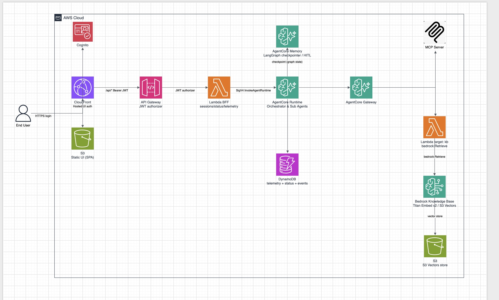

# Multi-Agent Orchestrator (LangGraph + Amazon Bedrock AgentCore)

A production-style, **configuration-driven** multi-agent orchestration built with
**LangGraph** and deployed on **Amazon Bedrock AgentCore Runtime**. It runs a
small, generic **research → analysis → report** pipeline that demonstrates the
core patterns you need to build your own multi-agent system: sequential and
parallel execution, RAG, MCP tool access, human-in-the-loop review, durable
state, and per-run cost/token observability — all defined in one `workflow.json`.

This is a **reference pattern**, not a finished product for any one domain. The
sample topic (`"Design a serverless data pipeline on AWS"`) and the six agents
are intentionally generic — swap the prompts, contracts, and Knowledge Base
corpus for your use case.

## Patterns demonstrated

- **Sequential + parallel** execution — a **parallel** group (two agents run
  concurrently, join at one gate) and a **sequential** group (two agents run in
  order, one gate after both), side by side so the difference is explicit.
- **RAG** — a Bedrock Knowledge Base (backed by **S3 Vectors**) exposed as a
  Gateway tool; the `knowledge_research` agent retrieves grounded context, scoped
  to its own corpus (`doc_type`) via Knowledge Base metadata filtering.
- **MCP / Gateway-fronted tools** — the `web_research` agent reaches an MCP
  server through a single **AgentCore Gateway** (Cognito-authed). The default
  target is the public **AWS Knowledge MCP** server (no credentials required).
- **Human-in-the-loop (HITL)** — approval gates with **approve / revise / deny**
  after a single agent, after the **parallel group** (revise re-runs only the
  agents you flag), and after the **sequential group** (revise re-runs the whole
  chain from the start).
- **Structured, validated output** — every agent emits a Pydantic contract asset
  with an evidence classification and claim tracing, so a reviewer can trust,
  exclude, or challenge each input.
- **Per-agent runtime placement** — each agent runs **in-process** in the
  orchestrator (`runtime: "main"`) or, by flipping one config field, in its **own
  dedicated AgentCore Runtime** (`runtime: "dedicated"`), invoked cross-runtime
  via `InvokeAgentRuntime`. In this sample the two research agents run on their
  **own dedicated runtimes**; the rest run in-process.
- **Cognito** — end-user **SPA login** for the UI (API Gateway JWT authorizer) and
  **machine-to-machine** (client-credentials) auth for agent → Gateway calls.
- **Run management** — stop/cancel a running pipeline (a durable cancel flag honored
  at every node boundary and heartbeat) and delete a previous run from the UI.
- **Durable state** — LangGraph checkpointing persisted in **AgentCore Memory**
  (HITL pause/resume across gates).
- **Live progress** — status mirrored to **DynamoDB**; the UI polls it for real-time per-agent status.
- **Cost & token observability** — every model / tool / compute event is metered
  (exact Bedrock tokens, latency, estimated USD) to a telemetry table. An in-app
  **Observability** tab drills down per run (per-agent → per-call) and aggregates
  by date / model / user, with cost projection and CSV/JSON export. Kept isolated
  in `app/observability/` + `terraform/observability.tf` + `web/observability.js`
  so it can be understood or removed as a unit.
- **Consistent time** — all stored and displayed timestamps are US Eastern Time in
  `YYYY-MM-DD HH:MM:SS`, via a single dependency-free helper (`app/common/clock.py`).

## The workflow

A 4-stage, 6-agent pipeline, defined entirely in
[`orchestrator/app/workflow.json`](orchestrator/app/workflow.json). It
deliberately contrasts a **parallel** group with a **sequential** group:

```
1 Intake ─(HITL)─▶ 2 [ knowledge_research ‖ web_research ] ─(HITL)─▶
3 [ analysis → recommendation ] ─(HITL)─▶ 4 Report
```

Agents are keyed by **semantic ids** in `workflow.json` (e.g. `intake`,
`analysis`); each has a self-contained package under `app/subagents/<id>/`.

| # | Stage | Agent id(s) | Pattern | Notes |
|---|-------|-------------|---------|-------|
| 1 | Request Intake | `intake` | single | LLM turns the request into a structured brief; HITL gate after |
| 2 | Research | `knowledge_research`, `web_research` | **parallel** (**RAG** ‖ **MCP**), each on a **dedicated runtime** | run concurrently in their own AgentCore runtimes; one HITL group gate after both |
| 3 | Analysis → Recommendation | `analysis`, `recommendation` | **sequential** | run one after another; one HITL gate after both complete (revise re-runs the whole chain) |
| 4 | Report | `report` | terminal | assembles the final sectioned report (no gate) |

Each agent entry in `workflow.json` also carries declarative `sources` / `access` /
`produces` metadata (and a `rag` corpus for the KB agent), surfaced as chips in the
UI for lineage clarity.

## Architecture



```
                    ┌── Cognito ─┐  (SPA login for users; M2M tokens for the runtime)
                    ▼            ▼
Browser ─▶ CloudFront ─┬─▶ S3 (static UI)
   (Bearer JWT)        └─▶ API Gateway (JWT authorizer) ─▶ Lambda (BFF)
                             │                               (reads DynamoDB status)
                             │ InvokeAgentRuntime
                             ▼
                     AgentCore Runtime (orchestrator)  ──▶ AgentCore Memory (checkpointer)
                     LangGraph: 1→[2‖2]→[3→3]→4               │
                       │  └─ InvokeAgentRuntime ─▶ Dedicated runtimes
                       │        (knowledge_research, web_research)
                       │ Cognito M2M token                     │
                       ▼                                       ▼
                     AgentCore Gateway (CUSTOM_JWT / Cognito) DynamoDB (status + events)
                       ├─ target: AWS Knowledge MCP  (web_research)
                       └─ target: KB retrieve Lambda ▶ Bedrock KB (S3 Vectors)  (knowledge_research)

   UI polls status ◀── DynamoDB ◀── runtime writes progress
```

- **Orchestrator runtime** runs the LangGraph pipeline. On invoke it registers an
  async task, runs the workflow in the background, and returns immediately — so
  the session stays alive across HITL pauses (up to the 8-hour session limit).
- **Gateway** is a single Cognito-authed MCP endpoint fronting the tool plane: the
  public AWS Knowledge MCP server and a Bedrock KB retrieve Lambda.
- **BFF (Lambda)** invokes the runtime, and serves DynamoDB-backed status + the
  workflow definition so the UI renders dynamically. `/api/*` is protected by the
  Cognito JWT authorizer.
- **UI** is static (S3/CloudFront): logs in via Cognito, renders the DAG from
  `/api/workflow`, drives the HITL gates, and polls for progress.

## Repository layout

```
orchestrator/
├── app/                        # application package
│   ├── workflow.json           # SINGLE SOURCE OF TRUTH: orchestrator block + agents + topology + HITL gates
│   ├── entry.py                # container entrypoint: AGENT_ID set -> a dedicated agent; unset -> orchestrator
│   ├── subagent_runtime.py     # per-agent AgentCore Runtime app (hosts one agent by AGENT_ID)
│   ├── common/                 # shared framework used by orchestrator + agents
│   │   ├── base.py             #   Agent base class (author contract)
│   │   ├── context.py          #   AgentContext: input(), llm(), mcp(), retrieve(), heartbeat(), log()
│   │   ├── config.py           #   loads workflow.json + env/infra settings
│   │   ├── state.py            #   graph state + reducers
│   │   ├── agentcore_agent.py  #   AgentCoreRuntimeAgent: node body for a dedicated agent (InvokeAgentRuntime)
│   │   ├── research.py         #   shared runner for the RAG/MCP research agents (doc_type-scoped)
│   │   ├── synthesis.py        #   shared runner for the analysis→report synthesis agents (structured JSON + graceful degrade)
│   │   ├── contracts/          #   Pydantic asset contracts (brief, research, analysis, recommendation, report)
│   │   ├── clock.py            #   Eastern-Time helper (all timestamps: YYYY-MM-DD HH:MM:SS ET)
│   │   └── llm.py, mcp.py, sink.py, bus.py   # infra helpers (mcp.py = Gateway client)
│   ├── observability/          # ISOLATED cost/token/latency capture (see terraform/observability.tf, web/observability.js)
│   ├── orchestrator/           # the orchestration engine + entrypoints
│   │   ├── graph_builder.py    #   builds the LangGraph (single / parallel / sequence steps + their HITL gates)
│   │   ├── nodes.py            #   generic agent-node + HITL-gate wrappers (single, parallel-group, sequence-group gates)
│   │   ├── registry.py         #   node factory: main (in-process module) vs dedicated (AgentCoreRuntimeAgent)
│   │   ├── runtime.py          #   AgentCore entrypoint (start / resume)
│   │   └── server.py           #   local dev server (same API + UI)
│   └── subagents/<name>/       # one self-contained package per agent (agent.py + prompts.py + __init__.py):
│                               #   intake, knowledge_research, web_research, analysis, recommendation, report
├── web/index.html              # config-driven UI: Cognito login, DAG, HITL gates, outputs
├── web/observability.js        # self-contained Observability tab (charts, drilldown, aggregation, export)
├── bff/handler.py              # Lambda BFF (sessions: create/list/get/delete + decisions + cancel + telemetry reads)
├── kb_lambda/handler.py        # Gateway Lambda target: Bedrock KB retrieve
├── kb_docs/reference/          # sample Knowledge Base corpus (replace with your own)
├── Dockerfile, requirements.txt, requirements-dev.txt
├── cdk/                        # CDK / TypeScript IaC (core footprint; alternative to terraform/)
│   ├── bin/orchestrator.ts     #   app entrypoint (context: agentName, modelId, cognito*, …)
│   ├── lib/orchestrator-stack.ts  # the stack (runtimes, DynamoDB, BFF/API, S3+CloudFront UI)
│   └── package.json, cdk.json, tsconfig.json, README.md
└── terraform/                  # full IaC (adds the Gateway + Knowledge Base)
    ├── main.tf                 # orchestrator runtime, memory, ECR + image build/push, IAM
    ├── subagent_runtimes.tf    # one AgentCore Runtime per dedicated agent (the 2 research agents)
    ├── cognito.tf              # auto-create Cognito User Pool + domain + SPA client (create_cognito = true)
    ├── gateway.tf              # AgentCore Gateway + Cognito JWT authorizer + MCP target
    ├── kb.tf                   # S3 Vectors + Bedrock KB + retrieve Lambda + Gateway target
    ├── observability.tf        # telemetry DynamoDB table (+ by_date GSI) + IAM + observability.js UI asset
    ├── bff.tf, ui.tf, dynamo.tf, variables.tf, outputs.tf, versions.tf
    └── deploy-role-policy.json # scoped IAM policy a deploy role needs
```

## Add or change an agent

An agent's `workflow.json` key IS its module name (the package under
`app/subagents/<id>/`); a `runtime` field decides *where* it runs. Both modes use
the same `Agent` interface, so the graph wiring is identical.

1. Create `orchestrator/app/subagents/<id>/agent.py` (and a `prompts.py`):
   ```python
   from app.common.base import Agent

   class MyAgent(Agent):
       system_prompt = "You are ..."
       async def run(self, ctx):
           return await ctx.llm(self.system_prompt, ctx.input("analysis") or ctx.topic)

   agent = MyAgent()
   ```
   and `orchestrator/app/subagents/<id>/__init__.py` with `from .agent import agent`.
2. Add it to `orchestrator/app/workflow.json` under `agents` and place it in `steps`
   (sequential, in a `parallel` group, and/or with `"hitl": true`).
   - **In-process** (default): `"runtime": "main"`.
   - **Own runtime**: `"runtime": "dedicated"` — Terraform provisions a separate
     AgentCore Runtime for it automatically (it reads `workflow.json`).
3. Redeploy. The graph, dedicated runtimes, status tracking, and UI pick it up automatically.

## Run locally

```bash
python -m venv .venv && source .venv/bin/activate
pip install -r orchestrator/requirements-dev.txt

cd orchestrator
uvicorn app.orchestrator.server:app --port 8090
# open http://127.0.0.1:8090
```

Notes:
- Without AWS credentials the LLM falls back to a simulated response, so the flow still runs.
- With `GATEWAY_URL` unset (the local default), MCP/KB calls return a simulated response.
- `dedicated` agents (the two research agents) return a "not configured" placeholder
  locally — there are no dedicated runtimes to invoke off-cloud; they run for real once deployed.

## Deploy

Two infrastructure-as-code options are provided. They can target **different
accounts or regions** simultaneously (resource names include the account ID, so
there are no global collisions):

- **Terraform** (`orchestrator/terraform/`) — the **full** deployment, including the
  optional **AgentCore Gateway + Bedrock Knowledge Base** for live MCP + RAG. See
  **[`DEPLOYMENT.md`](DEPLOYMENT.md)**.
- **CDK / TypeScript** (`orchestrator/cdk/`) — the **core** deployment (orchestrator
  + dedicated runtimes + DynamoDB + BFF/API + UI). It matches Terraform with
  `enable_gateway = false`: LLM inference is real, MCP/RAG run simulated. See
  **[`orchestrator/cdk/README.md`](orchestrator/cdk/README.md)**.

Both support **auto-creating Cognito** (User Pool + domain + SPA client) so no
pre-existing auth infrastructure is required.

### Terraform

> To front your own MCP server or REST API through the Gateway, follow the inline
> notes in `orchestrator/terraform/gateway.tf`.

Requires: Terraform, a container engine (Finch/Docker/Podman), and AWS credentials.

```bash
cd orchestrator/terraform
cp terraform.tfvars.example terraform.tfvars   # then edit
# Set: region, create_cognito = true, enable_gateway = false (or true with full Cognito)
terraform init                                 # first time only
terraform apply                                # builds the image, provisions everything
```

| Cognito mode | Configuration |
|---|---|
| **Auto-create** (recommended) | `create_cognito = true` in `terraform.tfvars` |
| **Bring your own** | Set `cognito_user_pool_id`, `cognito_user_pool_client_id`, `cognito_domain_prefix` |
| **No auth** (sandbox only) | Leave `create_cognito = false` and all `cognito_*` empty |

Outputs include `ui_url` (CloudFront), `api_endpoint`, `cognito_user_pool_id`, and
`cognito_client_id`. After deploy, add `ui_url` to the Cognito App Client's Allowed
Callback/Sign-out URLs. Tear down with `terraform destroy`.

### CDK (TypeScript)

```bash
cd orchestrator/cdk
npm install
export CDK_DOCKER=finch          # only if you don't have Docker
cdk bootstrap                    # first time per account/region
cdk deploy -c createCognito=true # auto-creates Cognito; or pass existing values
```

| Cognito mode | Command |
|---|---|
| **Auto-create** (recommended) | `cdk deploy -c createCognito=true` |
| **Bring your own** | `cdk deploy -c cognitoUserPoolId=… -c cognitoClientId=… -c cognitoDomainPrefix=…` |
| **No auth** (sandbox only) | `cdk deploy` |

After deploy, add the `uiUrl` output to Cognito's Allowed Callback/Sign-out URLs.
Tear down with `cdk destroy`. Full details in
[`orchestrator/cdk/README.md`](orchestrator/cdk/README.md).

## Configuration

| Variable / env var             | Default                                          | Purpose                                       |
|--------------------------------|--------------------------------------------------|-----------------------------------------------|
| `model_id` / `BEDROCK_MODEL_ID`| `us.anthropic.claude-haiku-4-5-20251001-v1:0`    | Default model (env > `orchestrator.defaultModel` > this) |
| `region` / `AWS_REGION`        | `us-east-1`                                      | Region                                        |
| `create_cognito`               | `false`                                          | Auto-create Cognito User Pool + domain + SPA client |
| `enable_gateway`               | `true`                                           | Create the Gateway + KB (Cognito-authed)      |
| `cognito_user_pool_id`         | —                                                | Cognito User Pool ID (UI login + Gateway); ignored if `create_cognito = true` |
| `cognito_user_pool_client_id`  | —                                                | Cognito App Client ID (SPA, public); ignored if `create_cognito = true` |
| `cognito_domain_prefix`        | —                                                | Cognito Hosted UI domain prefix; ignored if `create_cognito = true` |
| `cognito_gateway_client_id`    | —                                                | Cognito M2M App Client ID (agent → Gateway)   |
| `cognito_gateway_client_secret`| — (via `TF_VAR_…`)                               | Cognito M2M client secret (never committed)   |
| `cognito_gateway_scope`        | —                                                | OAuth2 scope for Gateway access               |
| `gateway_mcp_endpoint`         | `https://knowledge-mcp.global.api.aws`           | MCP-server target (front a different MCP here) |
| `LONG_STEP_SECONDS`            | `1.2`                                            | Per-step delay for long-running agents (env > `orchestrator.longStepSeconds`) |

The table above is for the **Terraform** path. The **CDK** app exposes the same
settings as context keys (`agentName`, `modelId`, `createCognito`, `cognitoUserPoolId`,
`cognitoClientId`, `cognitoDomainPrefix`, `memoryEventExpiryDays`) — pass them via
`cdk.json` or `-c key=value`. See [`orchestrator/cdk/README.md`](orchestrator/cdk/README.md).

## Security, cost & scalability

This is a **reference sample**, not a production-hardened product. It demonstrates
sound patterns and sensible defaults, but you must review and harden it for your
own environment before any non-sandbox use.

**Security — what's built in**
- Cognito **SPA login** on the UI and an **API Gateway JWT authorizer** on `/api/*`.
- Cognito **machine-to-machine** (client-credentials) tokens for agent → Gateway
  calls; the Gateway uses a **CUSTOM_JWT** authorizer that pins the client via `client_id`.
- **SigV4/IAM** for internal service-to-service calls (BFF → runtime).
- **Scoped IAM roles** per component (orchestrator, dedicated agents, BFF, KB Lambda, Gateway).
- No secrets in the repo; the M2M secret is passed only via `TF_VAR_…` at apply time.

**Security — harden before production**
- **Auth is optional and can be disabled.** With `enable_gateway = false` and empty
  `cognito_*`, the UI/API are **open**. Do not run that mode anywhere shared.
- **Authentication only — no authorization (RBAC).** Any logged-in user can drive any run.
- No **WAF**, request throttling, or usage plans on API Gateway.
- CloudFront uses the **default certificate** (no custom domain/TLS policy hardening).
- The Gateway client secret is delivered as a **runtime environment variable**;
  prefer **AWS Secrets Manager** with rotation for production.
- Buckets use `force_destroy = true` (convenient for teardown; enable versioning +
  retention for real data). Set **log retention** and **CloudWatch alarms** as needed.
- Treat all LLM/MCP/RAG output as untrusted; add output filtering/guardrails for your domain.

**Cost — optimized for a sample**
- Serverless and **scale-to-zero** throughout: AgentCore runtimes, Lambda (BFF/KB),
  DynamoDB (**PAY_PER_REQUEST**), and **S3 Vectors** (no vector-store floor).
- **Claude Haiku** is the default model (cheap); per-agent model is configurable.
- Telemetry rows carry a **TTL**; the in-app Observability tab shows real per-run cost.
- Cost knobs: CloudFront `PriceClass_All` (narrow it), the two dedicated runtimes add
  a little vs. all-in-process, and KB ingestion + embeddings when the Gateway is enabled.

**Scalability**
- LangGraph on AgentCore runs stages **sequentially/parallel** per config, with the
  two research agents on **independent dedicated runtimes**; the orchestrator runs the
  workflow as a background task and persists across HITL pauses (up to the 8-hour limit).
- Known limits (documented below): the UI uses **polling** (not push), and the
  cross-runtime call to a dedicated agent is **synchronous** request/response.

## Notes / current limitations

- **Per-agent runtimes are supported** — flip an agent to `runtime: "dedicated"`
  in `workflow.json` to give it its own AgentCore Runtime (Terraform provisions it
  automatically). The cross-runtime call is synchronous request/response.
- **Auth is authentication-only** — per-agent role-based authorization is a future enhancement.
- **UI transport is polling** (DynamoDB-backed). Swap to DynamoDB Streams →
  WebSocket/AppSync for instant push without changing the runtime.
- **Parallel-group HITL** — the gate after the parallel group carries a per-agent
  decision; "revise" re-runs only the agents you flag.
